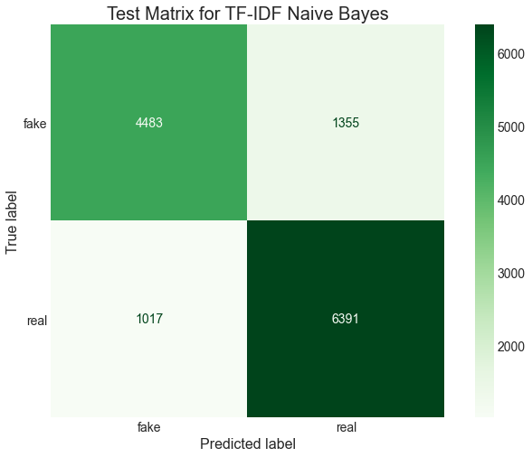

# Fake News Detector

## Problem
Social media platforms are routinely plagued with low quality and clickbaiting stories that are extremely unreliable along with an assortment of conspiracy theories and manipulative disinformation. The presence of this information on these platforms is both a major social and political issue, and is a major problem for the platform's brands. For example, millions of people refuse to use facebook precisely because of the sense that it's platform is being used to spread dangerous and false ideas. But, others have been just as upset by what they see as censorship or heavyhandedness in the responses to misinformation. There is unfortunately no solution to this issue that everyone will agree on, but automated tagging of misinformation or alterations to algorthms to not promote certain stories is likely to be a part of social media for the forseeable future.

## What Can a Model Reasonably Do?
Unfortunately, no machine learning model can totally solve the problem with false news stories. Models have no direct access to the ground truths that exist in the world, only whatever text and other information we have assigned particular labels. How reliable they will be will depend significantly on how reliable the information that is being given to them. For example, a model that used wikipedia as a source of reliable ariticles could only be as reliable as the moderation on wikipedia.

With this in mind it is important to understand what a machine learning model can reasonable do with respect to this problem.

1) Recognize formating and coherence issues in articles, which can be an indication of unreliability
2) Recognize similarities between fake or real stories that it was trained on and new versions of those stories
3) Recognize metdata and contextual features of certain source know to spread lots of false information

This means such systems are probably best aimed at filtering out lwo quality, incoherent sources feigning to be regular news source, and filtering out stories containing information that some accepted fact checking source has already investigated.

This particular set of models will focus on the second task by creating a NLP classification model from a set of articles that have been tagged as fake or real by a source.

## The Data
Data for this project wa gathered from three places.

[FakeNewsNet](https://github.com/KaiDMML/FakeNewsNet): 
This was a database constructed as described in this [paper](https://arxiv.org/abs/1809.01286). It consists of news articles marked by PolitiFact and GossipCop as either fake or real as well as tweets mentioning the articles and a wealth of other metadata. The data used in these models was scraped between 3/2-3/4 using the code from the FakeNewsNet git repo.

		Only the data from the articles was scraped and not all the associated tweet, since this model will focus on.
		405 Fake stories maked by PolitiFact 
		536 Real stories marked by PolitiFact 
		5323 Fake stories marked by GossipCop 
		16817 Real stories marked by GossipCop

[Fake and real news dataset](https://www.kaggle.com/clmentbisaillon/fake-and-real-news-dataset) from kaggle 
This dataset was originally collected to be used in this [paper](https://www.semanticscholar.org/paper/Detection-of-Online-Fake-News-Using-N-Gram-Analysis-Ahmed-Traor%C3%A9/3e4d892fa31ef958abaaabb9a66513096d60f8e8).
The data consists of fake news articles marked by PolitiFact as well as a collection of articles taken from Reuters that function as the real news articles. Care was taken to make sure the Reuters article was cleaned of the (Reuters) header so the classifier doesn’t just equate real news with “WASHINGTON (Reuters)”  being at the start of most of the  the real articles. Many of the analyses on kaggle have inflated F1 scores, and this is perhaps partly due to using the data as is and not removing these markers. 

    The data contains:
    17903 Fake stories marked by Politfact
    20826 Real stories from Reuters

[Source Based Fake News Classification](https://www.kaggle.com/ruchi798/source-based-news-classification)
The data was originally created for this [paper](http://www.ijirset.com/upload/2020/june/115_4_Source.PDF). The paper cleaned up metadata scraped from 244 websites tagged as "bullshit" by the BS Detector Chrome Extension by Daniel Sieradski. The BS detector marked stories with more nuanced labels, like junk science, biased, hate speech, conspiracy, etc. The authors relabel the data so that merely biased articles were marked as real and only conspiracy, junksci, bs and the like were marked as fake. this data may be useful as a good contrast to the previous dataset, since even the real stories have significant biases, which will hopefully help minimize the extent to which merely biased stories are marked as fake news.

    There are probably some worries about the reliability of this data in particular, but was a fairly small set with only
    1244 Fake stories
    762 Real (but biased) Stories

These three sources were all chosen because they all contain the titles and complete text for the news stories as well as roughly equivalent labeling. There is also a clear advantage of using the mixed dataset, since it avoids biasing the data by too much of a single source of a particular label, and includes a mix of politics as well as fake political and science news, giving a breadth of data that would hopefully make a model constructed from it a bit more generalizable.

## Exploring the Data
A full exploration the data can be found in the EDA notebook. To start, single word and bigram frequency in the fake and real story texts were examined and words clouds we constructed. Below we can see the clouds for the bigrams for the real and fake stories. We can tell there are some significant difference in the data between the two categories, which is to be expected given how it is sourced.

A LDA model was used to categorize the articles into topic, the topics align quite reasonably with the known sources. A grid search between 5 and 10 categories was used to select the optimal number of topic clusters. Below we can see the clustering using pyLDAvis

The data clustered fairly well into five topic categories. Examining the categories they corresponded roughly to:

    Political campaign
    Government
    Celebrity: movies/TV
    Celebrity: music
    Foreign News

## Method of Modeling
The full text was be used as the sole predictor, since the models performed quite well even without the titles

Four different methods of embedding the full article text were used
    TF-IDF 
    Bag of Words
    GloVe
    BERT

The embedded text was used to train a number of ML classification models using the labels of “Fake” and “Real” as the targets. The models included:
    Naive Bayesian
    Logistic
    Random Forest
    XGBoost
    Neural Networks

### The Models

#### Naive Bayesian TF-IDF

#### Logistic TF-IDF

#### Random Forest TF-IDF

#### XGBoost TF-IDF

#### Bag of Words RNN

#### GloVe Model

#### BERT Model

The final model was selected by considering the weighted F1 score, which turned out to be the GloVe embedded model

### Final Results by Topic
We can see that the model had the fewest errors in the two most common topics, which is a sign that performance will likely rise with more data in the other categories. The unusual result is in the foreign news category, which had significant amounts of data. This poor performance is likely due to a number of things, first there is likely more inherent diversity of topic with the broad area of 'anything outside the US', secondly, since these categories were derived using LDA, the cluster is not perfect and contains significant errors and oversimplifications, the foreign news "topic" is somewhat of a misnomer. The topic likely contains a bunch of other topics that just didn't happen to fit into the other categories.

## Interpreting the Models
Lime was used to examine how the models were attending to the text, and offers some insight into how the models arrive at their predictions. For a more indepth look, consult the interpretation section of the modeling notebook. Here we will just go through two pairs of examples.

#### Bayes Lime
We can see at least some interesting things even in the worst performer, the bayesian model, it seems to recognize there is a lot of fake news about Obama, and seems to pick up on 'probably' as a sign of fakeness, likely due to conspiracy sites engaging in more speculation. some useful words like 'bs' are not recongized, likely due to the limited dictionary of 20,000 words used in tokenizing for TF-IDF.

The model seems to pick up on formal language like "coalition forces" as well as 'said' which is a frequent occurence in news articles quoting sources as signs of real news. It also seems to pick up on 'Tuesday" as indicating realness, again likely because news sources are more likely to report on the exact timing of events than the fake sources. It, however, didn't pick up on "washington" a frequent header in reuters articles.

#### GloVe Lime
The GloVe model placed a lot of weight on 'bs' which seems reasonable, since professional news sites are unlikely to use such language. It also picked up on speculative language like "guess" and weighted mention of Obama as signs of fakeness, which is probably not ideal

The GloVe model picked up on formating of the Reuters articles like this one. We can see this in its treatment of "washington" as a positive indicator of real news as well as language frequently used in quotations like "said" which appear frequently in mainstream news sources. 

### Citations
@article{turc2019,
  title={Well-Read Students Learn Better: On the Importance of Pre-training Compact Models},
  author={Turc, Iulia and Chang, Ming-Wei and Lee, Kenton and Toutanova, Kristina},
  journal={arXiv preprint arXiv:1908.08962v2 },
  year={2019}
}

@article{shu2018fakenewsnet,
  title={FakeNewsNet: A Data Repository with News Content, Social Context and Dynamic Information for Studying Fake News on Social Media},
  author={Shu, Kai and  Mahudeswaran, Deepak and Wang, Suhang and Lee, Dongwon and Liu, Huan},
  journal={arXiv preprint arXiv:1809.01286},
  year={2018}
}

@article{shu2017fake,
  title={Fake News Detection on Social Media: A Data Mining Perspective},
  author={Shu, Kai and Sliva, Amy and Wang, Suhang and Tang, Jiliang and Liu, Huan},
  journal={ACM SIGKDD Explorations Newsletter},
  volume={19},
  number={1},
  pages={22--36},
  year={2017},
  publisher={ACM}
}

@article{shu2017exploiting,
  title={Exploiting Tri-Relationship for Fake News Detection},
  author={Shu, Kai and Wang, Suhang and Liu, Huan},
  journal={arXiv preprint arXiv:1712.07709},
  year={2017}
}

@inproceedings{Ahmed2017DetectionOO,
  title={Detection of Online Fake News Using N-Gram Analysis and Machine Learning Techniques},
  author={Hadeer Ahmed and Issa Traor{\'e} and Sherif Saad},
  booktitle={ISDDC},
  year={2017}
}