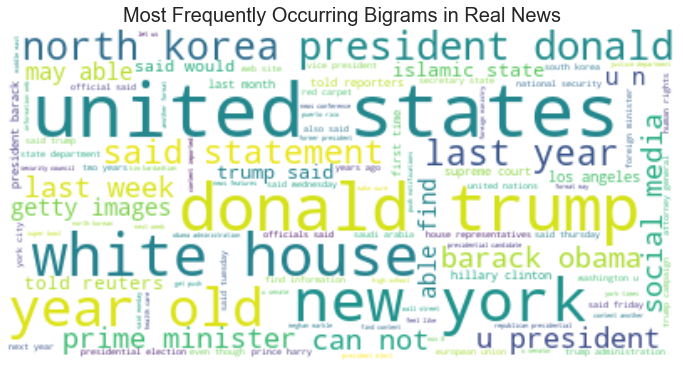
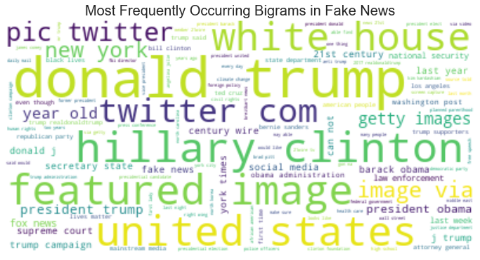
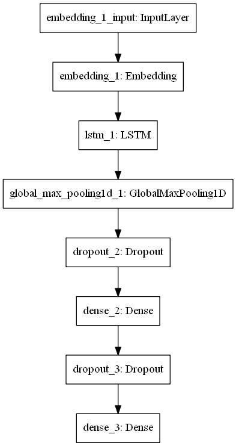

# Fake News Detector


The final model used by this fake news detector can tell fake from fake news in the testing data with 93.5% accuracy. An interactive version of this detector can be found [here.](https://share.streamlit.io/nonlocal-lia/fake_news_detector_streamlit/front_end.py) This repo contains a description of the modeling process and all the code used to construct the models.

## Problem
Social media platforms are routinely plagued with low quality and clickbaiting stories that are extremely unreliable, along with an assortment of conspiracy theories and manipulative disinformation. The presence of this information on these platforms is both a major social and political issue, and is a major problem for the platform's brands. For example, millions of people refuse to use Facebook precisely because they believe the platform is being used to spread dangerous and false ideas. But, others have been just as upset by what they see as censorship or heavyhandedness in the responses to misinformation. There is unfortunately no solution to this issue that everyone will agree on, but automated tagging of misinformation or alterations to algorthms to not promote certain stories is likely to be a significant part of social media for the forseeable future, and if it is going to be performed it is important that the models these algorthms are based around are as accurate as possible.

## What Can a Model Reasonably Do?
Unfortunately, no machine learning model can totally solve the problem with false news stories. Models have no direct access to the ground truths that exist in the world, only whatever text and other information we have assigned particular labels. How reliable they will be will depend significantly on how reliable the information that is being given to them. For example, a model that used wikipedia as a source of reliable ariticles could only be as reliable as the moderation on wikipedia.

With this in mind it is important to understand what kinds of things a machine learning model can reasonable do with respect to this problem, and there are at least four common approaches to the problem:

1) Recognize similarities between fake or real stories that it was trained on and new versions of those stories 
2) Recognize formating and coherence issues in articles, which can be an indication of unreliability
3) Recognize metdata and contextual features of certain sources known to spread lots of false information
4) Construct a model of a known evidence base and determine reliability relative to evidential support from the base

This particular set of models will focus on the first task by creating a NLP classification model from a set of articles that have been tagged as fake or real by a source. These kinds of models tend to be best aimed at filtering out low quality, incoherent sources feigning to be regular news source, and filtering out stories containing information that some accepted fact checking source has already investigated.

## The Data
Data for this project wa gathered from three places, for detailed instructions on how to recreate the data, see the README.md in the data folder..

[FakeNewsNet](https://github.com/KaiDMML/FakeNewsNet):

This was a database constructed as described in this [paper](https://arxiv.org/abs/1809.01286). It consists of news articles marked by PolitiFact and GossipCop as either fake or real as well as tweets mentioning the articles and a wealth of other metadata. The data used in these models was scraped between 3/2-3/4 using the code from the FakeNewsNet git repo. Only the data from the articles was scraped and not all the associated tweets, since this model won't focus on metadata or contextual clues indicating fake news sources.

This data contains:
* 405 Fake stories maked by PolitiFact 
* 536 Real stories marked by PolitiFact 
* 5323 Fake stories marked by GossipCop 
* 16817 Real stories marked by GossipCop

[Fake and real news dataset](https://www.kaggle.com/clmentbisaillon/fake-and-real-news-dataset) from kaggle:

This dataset was originally collected to be used in this [paper](https://www.semanticscholar.org/paper/Detection-of-Online-Fake-News-Using-N-Gram-Analysis-Ahmed-Traor%C3%A9/3e4d892fa31ef958abaaabb9a66513096d60f8e8).
The data consists of fake news articles marked by PolitiFact as well as a collection of articles taken from Reuters that function as the real news articles. Care was taken to make sure the Reuters article was cleaned of the (Reuters) header so the classifier doesn’t just equate real news with “WASHINGTON (Reuters)”  being at the start of most of the  the real articles. Many of the analyses on kaggle have inflated F1 scores, and this is perhaps partly due to using the data as is and not removing these markers. 

This data contains:
* 17903 Fake stories marked by Politfact
* 20826 Real stories from Reuters

[Source Based Fake News Classification](https://www.kaggle.com/ruchi798/source-based-news-classification):

The data was originally created for this [paper](http://www.ijirset.com/upload/2020/june/115_4_Source.PDF). The paper cleaned up metadata scraped from 244 websites tagged as "bullshit" by the BS Detector Chrome Extension by Daniel Sieradski. The BS detector marked stories with more nuanced labels, like junk science, biased, hate speech, conspiracy, etc. The authors relabeled the data so that merely biased articles were marked as real and only conspiracy, junksci, bs and the like were marked as fake. This data may be useful as a good contrast to the previous dataset, since even the real stories have significant biases, which will hopefully help minimize the extent to which merely biased stories are marked as fake news. There are probably some worries about the reliability of this data in particular, but was a fairly small set.

This data contains
* 1244 Fake stories
* 762 Real (but biased) Stories

These three sources were all chosen because they all contain the titles and complete text for the news stories as well as roughly equivalent labeling. There is also a clear advantage of using the mixed dataset, since it avoids biasing the data by using too much of a single source of a particular label, and includes a mix of politics as well as fake celebrity and science news, giving a breadth of data that would hopefully make a model constructed from it a bit more generalizable.

## Exploring the Data
A full exploration the data can be found in the EDA notebook. To start, single word and bigram frequency in the fake and real story texts were examined and words clouds we constructed. Below we can see the clouds for the bigrams for the real and fake stories. We can tell there are some significant difference in the data between the two categories, which is to be expected given how it is sourced.




An LDA model was used to categorize the articles into topics. The overall topics align quite reasonably with the known sources, but the categorization is far from perfect. A grid search between 5 and 10 categories was used to select the optimal number of topic clusters. Below we can see the clustering using pyLDAvis, for an interactive version consult the EDA notebook or, even better, the [streamlit app](https://share.streamlit.io/nonlocal-lia/fake_news_detector_streamlit/front_end.py) 


The data clustered fairly well into five topic categories. Examining the categories they corresponded roughly to:

* Political campaign
* Government
* Celebrity: movies/TV
* Celebrity: music
* Foreign and Misc News

## Method of Modeling
The full article text was be used as the sole predictor.

Four different methods of embedding the full article text were used:
* TF-IDF with 1000 dimensional vectors
* Bag of Words with 20000 word maximum and 200 dimensional vectors
* GloVe (Common Crawl) using glove.42B.300d.txt which has 300 dimensional vectors
* BERT using a smaller BERT model from https://tfhub.dev/tensorflow/small_bert/bert_en_uncased_L-4_H-512_A-8/1

The embedded text was used to train a number of ML classification models using the labels of “Fake” and “Real” as the targets. The models included:
* Naive Bayesian with TF-IDF
* Logistic with TF-IDF
* Random Forest with TF-IDF
* XGBoost with TF-IDF
* Neural Networks with bag or words, GloVe and BERT

## Model Results

#### Naive Bayesian TF-IDF
The Bayesian model was the worst performer with an accuracy of 82% and an F1 Score of 0.82 on test data, but was the quickest to train and predict taking 0.0235 seconds to train.


#### Logistic TF-IDF
The logistic model was the 2nd worst performer with an accuracy of 88.7% and an F1 Score of 0.887 on test data, but was the 2nd quickest to train and predict taking 1.2189 seconds to train.


#### Random Forest TF-IDF
The forest model was the best of the TF-IDF models and non neural net model with an accuraccy of 92% an a weighted F1 score of 0.92 on test data, it did however take significantly long to train at 222.3309 seconds on a CPU.


#### XGBoost TF-IDF
The XGBoost mode performed marginally worse than the Forest model with an accuracy of 91.1% and a weighted F1 score of 0.911 on test data, but took about 1/4 the time of the forest model to fit at 53.8420 seconds on a CPU.


#### Bag of Words RNN
The neural network with the custom trained bad of words embedding containing 20,000 words and 200 vectors had the following structure:


The model performed marginally better than the TF-IDF models with 92.2% accuracy and an F1 score of 0.922 on test data. It did however take an order of magnitude longer to train on a CPU at 2145.0022 seconds, but was more reasonable to run on GPU.


#### GloVe Model
This model used a fixed untrainable GloVe embedding layer using the 42B 300 vector Common Crawl embedding from https://nlp.stanford.edu/projects/glove/. It had the following structure:



This was the best overall model with 93.5% accuracy and an F1 score of 0.935 on test data. It did however take lond to train on a CPU at 5934.0679 seconds, but was more reasonable to run on GPU.


#### BERT Model
This model used a pretrained and structure small BERT layer: 'https://tfhub.dev/tensorflow/small_bert/bert_en_uncased_L-4_H-512_A-8/1'. The BERT layer was trainable and additional dense layers were added to aid in learning. The model had the following structure:


This model had 92.1% accuracy and an F1 score of 0.921 on test data. It was the longest of all models to train on CPU at 41640.8367 seconds, but was a bit more reasonable to run on GPU. It's prediction output was also too slow to be useable without significant resources.


The final model was selected by considering the weighted F1 score, which turned out to be the GloVe embedded model


## Final Model(GloVe) Results by Topic
We can see that the model had the fewest errors in the two most common topics, which is a sign that performance will likely rise with more data in the other categories. The unusual result is in the foreign news category, which had significant amounts of data. This poor performance is likely due to a number of things, first there is likely more inherent diversity of topic with the broad area of 'anything outside the US', secondly, since these categories were derived using LDA, the cluster is not perfect and contains significant errors and oversimplifications, the foreign news "topic" is somewhat of a misnomer. The topic likely contains a bunch of other topics that just didn't happen to fit into the other categories.


## Interpreting the Models
Lime was used to examine how the models were attending to the text, and offers some insight into how the models arrive at their predictions. For a more indepth look, consult the interpretation section of the modeling notebook or even better go to the [streamlit app](https://share.streamlit.io/nonlocal-lia/fake_news_detector_streamlit/front_end.py). Here we will just go through two pairs of examples.

#### Bayes Lime
We can see at least some interesting things even in the worst performer, the bayesian model, it seems to recognize there is a lot of fake news about Obama, and seems to pick up on 'probably' as a sign of fakeness, likely due to conspiracy sites engaging in more speculation. Some useful words like 'bs' are not recognized, likely due to the limited dictionary of 20,000 words used in tokenizing for TF-IDF.


The model seems to pick up on formal language like "coalition forces" as well as 'said' which is a frequent occurence in news articles quoting sources as signs of real news. It also seems to pick up on 'Tuesday" as indicating realness, again likely because news sources are more likely to report on the exact timing of events than the fake sources. It, however, didn't pick up on "washington" a frequent header in reuters articles.


#### GloVe Lime
The GloVe model placed a lot of weight on 'bs' which seems reasonable, since professional news sites are unlikely to use such language. It also picked up on speculative language like "guess" and weighted mention of Obama as signs of fakeness, which is probably not ideal.


The GloVe model picked up on formating of the Reuters articles like this one. We can see this in its treatment of "washington" as a positive indicator of real news as well as language frequently used in quotations like "said" which appear frequently in mainstream news sources. 


## Limitations and Future Work

Although the models performed surprisingly well on the classification task, we should have some doubts about the generalizablity of the model. As we said during the interpretation, many of the features that the models were picking up on are time sensitive. For example, fake news about Obama and Trump may become less frequent and news about Biden more frequent with time. The range of topics and sources in the data was also rather limited. It is not clear that just having trained on mostly Reuter's articles that the model will be as capable of recognizing other real sources. (You can test this for yourself by inputing urls to new or non-Reuter's articles into the streamlit version of the model.)

Unfortunately, all of this means to some degree any model of this sort will need constant updating and retraining with new information as the common sources of misinformation change. An acceptable production version of the model would likely need to be constantly updated with new reliable sources on breaking news and newly tagged fake news stories to retain decent accuracy.

Useful future work should focus on collecting more varied sources of data, for example COVID and medical conspiracy related datasets which are being constructed, as well as trying to use non-content related features such as as coherence or perplexity in the recognition of poor quality sources. Such approaches have some promise of being more generalizable, at least in the domain of poor constructed spam fake news.

### Citations
@article{turc2019,
  title={Well-Read Students Learn Better: On the Importance of Pre-training Compact Models},
  author={Turc, Iulia and Chang, Ming-Wei and Lee, Kenton and Toutanova, Kristina},
  journal={arXiv preprint arXiv:1908.08962v2 },
  year={2019}
}

@article{shu2018fakenewsnet,
  title={FakeNewsNet: A Data Repository with News Content, Social Context and Dynamic Information for Studying Fake News on Social Media},
  author={Shu, Kai and  Mahudeswaran, Deepak and Wang, Suhang and Lee, Dongwon and Liu, Huan},
  journal={arXiv preprint arXiv:1809.01286},
  year={2018}
}

@article{shu2017fake,
  title={Fake News Detection on Social Media: A Data Mining Perspective},
  author={Shu, Kai and Sliva, Amy and Wang, Suhang and Tang, Jiliang and Liu, Huan},
  journal={ACM SIGKDD Explorations Newsletter},
  volume={19},
  number={1},
  pages={22--36},
  year={2017},
  publisher={ACM}
}

@article{shu2017exploiting,
  title={Exploiting Tri-Relationship for Fake News Detection},
  author={Shu, Kai and Wang, Suhang and Liu, Huan},
  journal={arXiv preprint arXiv:1712.07709},
  year={2017}
}

@inproceedings{Ahmed2017DetectionOO,
  title={Detection of Online Fake News Using N-Gram Analysis and Machine Learning Techniques},
  author={Hadeer Ahmed and Issa Traor{\'e} and Sherif Saad},
  booktitle={ISDDC},
  year={2017}
}

## Repository Structure

```
├── README.md                           <- The top-level README for reviewers of this project
├── modeling_notebook.ipynb             <- Narrative documentation of modeling process in Jupyter notebook
├── EDA_notebook.ipynb                  <- Narrative documentation of cleaning and exploration process in Jupyter notebook
├── presentation.pdf                    <- PDF version of project presentation
├── data                                <- Collection of all data used, contains README.md describing the data collection process
├── models                              <- saved versions of models under 100 Mb
├── code                                <- Functions for cleaning and processing the data and constructing visualizations
└── images                              <- Visualizations generated from code
     ├── Models                         <- Visualizations made during modeling
     └── EDA                            <- Visualizations made during EDA
```
